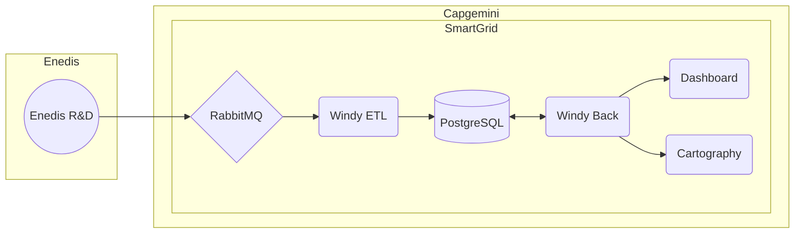

# RabbitMQ ETL Demo

Make sure an instance is running -> `docker run -d -p 5672:5672 -p 15672:15672 --name rabbit rabbitmq:alpine`

# Windy organisation

```mermaid
graph LR
    subgraph Enedis
        erd((Enedis R&D))
    end

    subgraph Capgemini
        subgraph SmartGrid
            rmq{RabbitMQ} -->
            wnde(Windy ETL) -->
            pgs[(PostgreSQL)] <-->
            wndb(Windy Back) --> dsh & gis
            dsh(Dashboard)
            gis(Cartography)
        end
    end

    erd --> rmq
```
